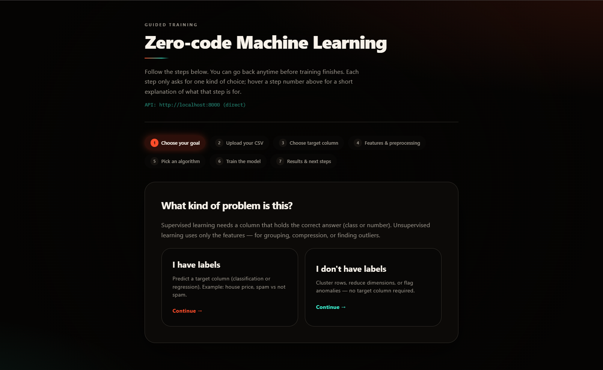

# Zero-Code ML

Train a scikit-learn pipeline from a CSV in the browser: pick a target column, configure preprocessing, download a runnable bundle, and predict — no ML code required.

**Stack:** FastAPI + scikit-learn (`requirements.txt`) · Next.js 15 (`web/`)

### Marketing / promo site

A separate **landing page** for promoting the project (product story, steps, example, GitHub CTAs) lives in **`landing/`**. It runs on **port 3001** so it does not clash with the app dashboard (**3000**).

```bash
npm run install:landing   # once
npm run landing:dev       # http://localhost:3001
```

Build for static hosting: `npm run landing:build` (output in `landing/.next`; deploy like any Next.js site, e.g. Vercel with root directory `landing`). Set `NEXT_PUBLIC_GITHUB_REPO_URL` in the host’s env to your real GitHub URL.

---

## Prerequisites

| Tool | Version |
|------|---------|
| Python | 3.11+ |
| Node.js | 20+ (includes npm) |

---

## First-time setup

Do this once after cloning.

### 1. Clone and enter the project

```bash
git clone https://github.com/vinit5112/Zero_Code_ML_Training.git
cd zero-code-ml
```

### 2. Python environment and packages

**macOS / Linux**

```bash
python3 -m venv .venv
source .venv/bin/activate
pip install -r requirements.txt
```

**Windows (PowerShell)**

```powershell
py -3 -m venv .venv
.\.venv\Scripts\Activate.ps1
pip install -r requirements.txt
```

**Windows (Command Prompt)**

```cmd
py -3 -m venv .venv
.venv\Scripts\activate.bat
pip install -r requirements.txt
```

### 3. Install Node dependencies

From the same `zero-code-ml` directory (repo root):

```bash
npm run install:all
```

This installs the root tooling (used to run both servers) and everything under `web/`.

---

## Run frontend and backend together

From the **repository root**, with your virtual environment **activated**:

```bash
npm start
```

That is the usual npm entry point: it starts **both** the API and the UI. (`npm run dev` does the same thing.)

This starts:

- **API** — FastAPI with hot reload at `http://127.0.0.1:8000`
- **UI** — Next.js dev server at `http://localhost:3000`

Open **[http://localhost:3000](http://localhost:3000)** in your browser. The UI calls the API through Next.js (`/api/...` is proxied to the backend; see `web/next.config.ts`).

API docs (Swagger): **[http://127.0.0.1:8000/docs](http://127.0.0.1:8000/docs)**

Stop both servers with **Ctrl+C** in the same terminal.

### After `npm start`

Open [http://localhost:3000](http://localhost:3000) — you should see the guided training flow (for example step 1: choose supervised vs unsupervised learning):



---

## If port 8000 is unavailable

Some systems block port 8000. Use another port and tell Next where the API is.

**Terminal (example: 8010)**

```bash
# macOS / Linux
API_PORT=8010 npm start
```

```powershell
# Windows PowerShell
$env:API_PORT = "8010"
npm start
```

**Create `web/.env.local`:**

```env
BACKEND_PROXY_URL=http://127.0.0.1:8010
NEXT_PUBLIC_API_URL=http://127.0.0.1:8010
```

Restart `npm start` after changing `.env.local`.

---

## Optional: advanced / production

| Goal | Command |
|------|---------|
| API only (e.g. UI already running elsewhere) | `npm run dev:api` |
| UI only (API already on port 8000) | `npm run dev:web` |
| Production build of the frontend | `npm run build:web` |

Reinstall Node deps after pulling changes: `npm run install:all`.

---

## Data and configuration

- Uploaded datasets and job artifacts live under **`data/`** (created automatically, gitignored).
- Optional env template: **`web/.env.local.example`** → copy to **`web/.env.local`** if you need direct API URLs or a custom proxy target.

---

## License

MIT — see [LICENSE](./LICENSE).

## Contributing

Issues and pull requests are welcome. Keep changes focused and consistent with existing Python and TypeScript style.
